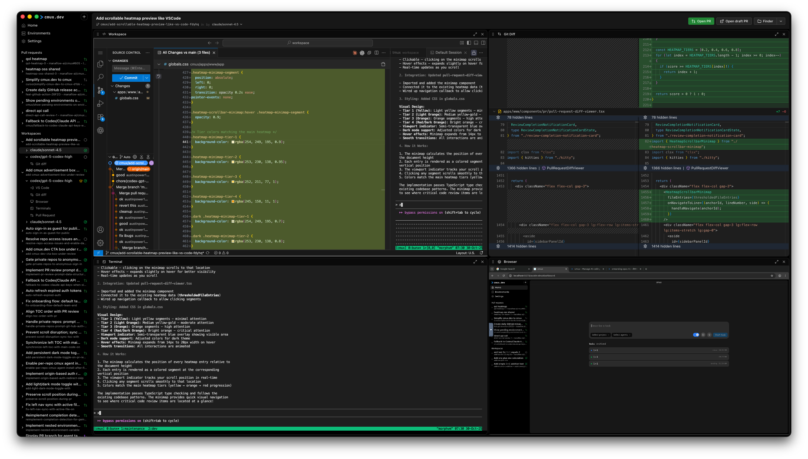

<h1 align="center">cmux</h1>
<p align="center">Open source Claude Code web/Codex Cloud/Devin alternative</p>

<p align="center">
  <a href="https://www.cmux.dev/direct-download-macos">
    
  </a>
</p>

<p align="center">
  Join the <a href="https://discord.gg/SDbQmzQhRK">Discord</a> to talk more about cmux!
</p>

cmux lets you spawn Claude Code, Codex CLI, Cursor CLI, Gemini CLI, Amp, Opencode, and other coding agent CLIs in parallel across multiple tasks.

Every run spins up an isolated VS Code workspace either in the cloud or in a local Docker container with the git diff view, terminal, and dev server preview ready so parallel agent work stays verifiable, fast, and ready to ship.

## Features

<table>
<tr>
<td width="50%">
<h3>Parallel Agent Orchestration</h3>
<p>Spawn Claude Code, Codex CLI, Gemini CLI, and other agents simultaneously. Select your model, write your prompt, and let multiple agents work on your codebase in parallel.</p>
</td>
<td width="50%">

</td>
</tr>
</table>

<table>
<tr>
<td width="50%">

</td>
<td width="50%">
<h3>Isolated VS Code Workspaces</h3>
<p>Each agent runs in its own sandboxed environment with full VS Code, source control, and terminal access. Watch the AI think and code in real-time.</p>
</td>
</tr>
</table>

<table>
<tr>
<td width="50%">
<h3>Live Web Preview</h3>
<p>Preview your app directly in the workspace while agents make changes. Embedded browser shows your dev server output alongside the code.</p>
</td>
<td width="50%">

</td>
</tr>
</table>

<table>
<tr>
<td width="50%">

</td>
<td width="50%">
<h3>One-Click PR Creation</h3>
<p>Review diffs, squash and merge, or open pull requests directly from the workspace. View GitHub Action results and CI status without leaving cmux.</p>
</td>
</tr>
</table>

<table>
<tr>
<td width="50%">
<h3>Full Workspace Monitoring</h3>
<p>See your agent's entire workspace at a glance—VS Code editor, Claude Code TUI, and VNC browser preview all in one view. Monitor exactly what your agent sees and does.</p>
</td>
<td width="50%">

</td>
</tr>
</table>

<table>
<tr>
<td width="50%">

</td>
<td width="50%">
<h3>Heatmap Diff Viewer for Code Reviews</h3>
<p>Automatically highlight risky code changes with color-coded annotations. Focus your review on the lines that matter most.</p>
</td>
</tr>
</table>

## Install

cmux supports macOS. Linux in beta. Windows coming soon.

<a href="https://www.cmux.dev/direct-download-macos">
  
</a>

<!-- ```bash
# with bun
bunx cmux@latest

# with npm
npx cmux@latest

# or to install globally
bun add -g cmux@latest
npm install -g cmux@latest
``` -->

<!-- ```bash
# with uv
uvx cmux@latest
``` -->

<!-- ## Upgrade

```bash
cmux upgrade
``` -->

<!-- ## Uninstall

```bash
cmux uninstall
``` -->
